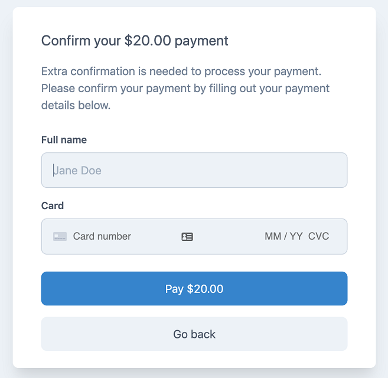

# Day 6 - pay Gem - Accept (One-Time) Payments or Subscriptions with Strong Customer Authentication (SCA) - Billing Engine on Top of Stripe, Braintre or Paddle


Written by  [Chris Oliver](https://github.com/excid3)

_Do things that scare you. Building [GoRails](http://GoRails.com), [Jumpstart](http://JumpstartRails.com), [Hatchbox](http://Hatchbox.io), [RailsBytes](http://RailsBytes.com), [Remote Ruby Podcast](https://remoteruby.transistor.fm/)._


## Accepting Payments in Rails

Adding subscriptions and one-time purchases to your Rails app can be a bit tricky, especially with Strong Customer Authentication (SCA). If you aren't familiar, SCA is a European regularly requirement to reduce fraud and make online payments more secure. For more details, I highly recommend reading the [Stripe guide on Strong Customer Authentication](https://stripe.com/guides/strong-customer-authentication).

For example, Braintree doesn't allow you to swap subscriptions between monthly and yearly plans. You actually have to cancel the subscription, calculate your proration amount and create a new subscription with the proration discount.

Pay makes this simpler by standardizing (as best as we can) subscriptions and one-time payments for:

* Stripe
* Braintree / PayPal
* Paddle

One place this comes in handy is if you want to primarily use Stripe but still want PayPal, you can use both with very little code changes. :thumbsup:


## Adding Pay to your app

We won't get into every single detail, but I want to highlight how Pay works at a high level.

First off, we'll run the Pay migrations to add models for `Pay::Subscription` and `Pay::Charge`. These keep track of subscriptions and payments for our `Billable` objects. A `Billable` is a model that makes payments in your app and you can have multiple of them (for example User and Team).

```ruby
class User < ActiveRecord::Base
  include Pay::Billable
end
```

This module adds methods to the User model so we can add payment methods and charge the user.

First, and most importantly you'll have to set the payment processor for the user:

```ruby
user.processor = "stripe"
```

So let's add a payment method:

```ruby
user.update_card('payment_method_id')
```

And subscribe the user to a plan:

```ruby
user.subscribe(plan: "my-plan")
```

That's it! Pay will create a Customer object and set the default payment method before charging the subscription.

### Webhooks

Webhooks are also required for most payment integrations these days as well. For example, you need webhooks to store subscription charges each month and to email receipts to your users.

Pay comes with all the required webhooks out of the box so you don't have to configure anything.

### Strong Customer Authentication (SCA)

Pay also supports SCA out of the box. If a payment requires authentication, Pay will raise an `Pay::ActionRequired` error that you can capture and send the user to confirm their payment. Banks may require you to authenticate the payment, so we make that workflow nice and easy for you with a pre-built confirmation page.




## Find Out More

### References

- Home :: [github.com/pay-rails/pay](https://github.com/pay-rails/pay)
- Gem :: [rubygems.org/gems/pay](https://rubygems.org/gems/pay)
- Screencast :: [How to add Payments in Rails with the Pay gem](https://gorails.com/episodes/pay-gem-rails?autoplay=1)

