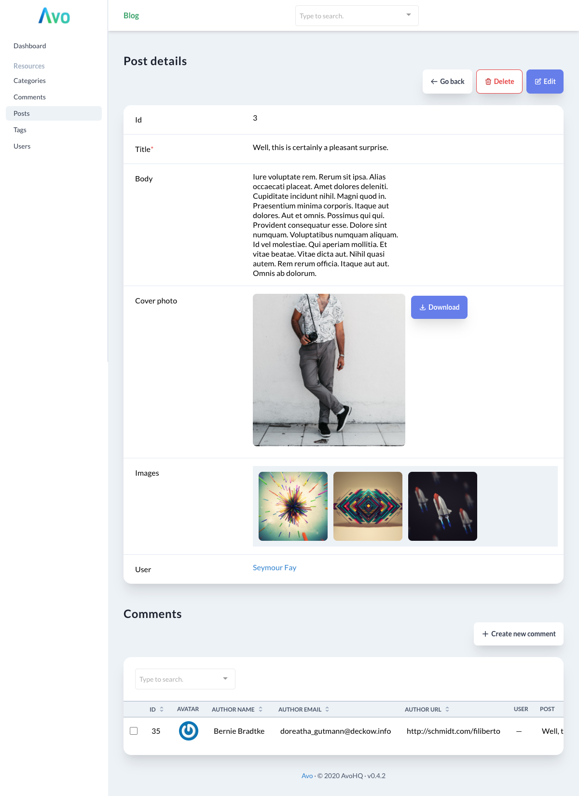

## Building good admins is challenging

It's even more challenging building them again and again.

[Avo](https://avohq.io) is a beautiful next-generation framework that empowers you, the developer, to create fantastic admin panels for your Ruby on Rails apps with the flexibility to fit your needs as you grow.

Out of the box, it has an excellent CRUD interface, ordering, filters, and actions. It knows how to handle your Active Record model relations and gives you powerful role-based authorization control options.

It's super easy to configure. Codewise, there's **one configuration file per model** and **one configuration line per field**.
You can add simple fields like text, textarea, dropdowns, and more complex ones like datetime, badges, loaders, currency, and others. There's even a cool one-liner single or multi-file Active Storage integration 🤯.
The whole interface is translatable along with resources and fields.

**Avo's mission is to make developers' jobs more comfortable and help them and companies move faster by giving them a cool easy [Rails admin](https://avohq.io) package that they can be proud of.**

## Get started

Let's cover the basics by imagining we're building a blog admin panel. To start, add `gem 'avo'` to your `Gemfile` and run `bin/rails generate avo:install` to generate the initializer and add the routes.

## Resources

The next step is to map your Rails models to Avo resources. `bin/rails generate avo:resource post` will generate the config file for the `Post` resource that looks like this:

```ruby
module Avo
  module Resources
    class Post < Resource
      def initialize
        @title = :id
        @search = :id
      end

      fields do
        id :id
      end
    end
  end
end
```

This will add the `Posts` link into the navigation with a beautiful CRUD interface.

From here we'll add a few basic fields for a `Post` (`title`, `body`, `is_published`, `cover_photo`, `images`, `category`, `tags`, `comments`). Some fields represent columns in the `posts` table, some are attached images and, some are relations to other resources.

```ruby
module Avo
  module Resources
    class Post < Resource
      def initialize
        @title = :id
        @search = :id
        @default_view_type = :grid
      end

      fields do
        id :id
        text :title
        trix :body
        file :cover_photo, is_image: true
        files :images, is_image: true
        boolean :is_published do |model|
          model.published_at.present?
        end

        belongs_to :user
        belongs_to :category
        has_many :comments
        has_and_belongs_to_many :tags
      end

      grid do
        preview :cover_photo
        title :title
        body :body
      end
    end
  end
end
```

These are all fields that come built into Avo. `text` is the most basic field that will render an `<input type="text" />`, `trix` will render the full WYSIWYG editor. `file` and `files` will take care of the images required for the post. `is_published` is computed field that checks to see if a timestamp is filled of not. At the end of the `fields` method we're left with the relation fields that render links or the full listings or the respective related resources.
You may notice we added `@default_view_type = :grid` in the initializer and the `grid` method to configure what we want to show in the grid view type.

Now the `Show` view looks like this:


And the `Index` view looks like this:


## Filters

Next, we'll add a filter to make it easier to find the published posts. We only need to run `bin/rails g avo:filter published`. That will generate the following:

```ruby
module Avo
  module Filters
    class Published < BooleanFilter
      def name
        'Published'
      end

      def apply(request, query, value)
        query
      end

      def options
        {}
      end
    end
  end
end
```

After we add the query scope and the option, it will look like this:

```ruby
module Avo
  module Filters
    class Published < BooleanFilter
      def name
        'Published'
      end

      def apply(request, query, value)
        query.where.not(published_at: nil)
      end

      def options
        {
          'published': 'Published'
        }
      end
    end
  end
end
```

Now we may use the `Published` filter on as many resources as we want to.

## Actions

Similarly, we can generate an `Action` that toggles the `published_at` value with `bin/rails g avo:action toggle_published`. The boilerplate looks like this:

```ruby
module Avo
  module Actions
    class TogglePublished < Action
      def name
        'Toggle published'
      end

      def handle(request, models, fields)
        models.each do |model|
          # Do something with your models.
        end
      end

      fields do
        # Add desired fields here.
      end
    end
  end
end
```

After we add the functionality we need it will look like this:

```ruby
module Avo
  module Actions
    class TogglePublished < Action
      def name
        'Toggle post published'
      end

      def message
        'Are you sure, sure?'
      end

      def handle(request, models, fields)
        models.each do |model|
          if model.published_at.present?
            model.update published_at: nil
          else
            model.update published_at: DateTime.now
          end
        end

        succeed 'Perfect!'
        redirect '/resources/posts'
      end

      def confirm_text
        'Toggle'
      end

      def cancel_text
        "Don't toggle yet"
      end
    end
  end
end
```

You can check out this demo app on [GitHub](https://github.com/avo-hq/blog-demo).

## Conclusion

This short tutorial scratches the surface of what Avo can do and how it can help you develop your app even faster than before.
Avo comes with **20+ fields**, **relations management**, **filters**, **actions**, **role-based authorization**, **localization**, **computed fields**, **eager loading**, **search**, and much more all while keeping you app clean without generating hard to maintain view and controller files.

We're in open beta and, we've got some cool things on the [roadmap](https://avohq.io/roadmap) for the coming months.

Come check it out on [AvoHQ.io](https://avohq.io) ([docs](https://docs.avohq.io)) and [GitHub](https://github.com/avo-hq/avo) (GH stars are most welcomed 🙏 ).
We're on [Twitter](https://twitter.com/avo_hq) and hang around our [Discord](https://discord.gg/pkTF6y8) server if you want to drop in to say hi 👋.