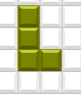
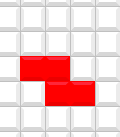

# Day 5 - glimmer-dsl-swt Gem - Glimmer Tetris - The Playfield - Get Tetris Working in One Day!

Written by  [Andy Maleh](https://github.com/AndyObtiva)

_Software Engineering Expert from Montreal, Quebec. Creator of [Glimmer](https://github.com/AndyObtiva/glimmer) and [Abstract Feature Branch](https://github.com/AndyObtiva/abstract_feature_branch). Speaker at RailsConf, RubyConf, AgileConf, EclipseCon, EclipseWorld. Master in Software Engineering, DePaul University, Chicago. Blogs at [Code Mastery Takes Commitment To Bold Coding Adventures](http://andymaleh.blogspot.com/). Snowboarder and Drummer._

## Goal

Use Glimmer DSL for SWT in JRuby to build the classic Tetris game for desktop computers, beginning with The Playfield that drops Tetromino blocks downward and receives user input for Tetromino movement direction and rotation.

## Pre-requisites

Make sure you first meet all the [pre-requisites](https://github.com/AMaleh/glimmer-dsl-swt/tree/v4.20.0.0#pre-requisites) of [Glimmer DSL for SWT](https://github.com/AMaleh/glimmer-dsl-swt/tree/v4.20.0.0) v4.20.0.0

Mainly, Java (specified version), JRuby (specified version), and Git (and RVM on Mac/Linux)

## Setup

Open a terminal screen and install the [glimmer-dsl-swt](https://rubygems.org/gems/glimmer-dsl-swt) gem with JRuby's jgem command (similar to Ruby's gem command).

```
jgem install glimmer-dsl-swt -v4.20.0.0
```

On the Mac, additionally run `glimmer-setup`:

```
glimmer-setup
```

## Scaffolding

Glimmer DSL for SWT offers a command for scaffolding a simple Glimmer desktop application from scratch,
starting by installing the required project gems (scoping by a separate gemset if you are using RVM),
moving on to generating the project MVC-friendly directory structure and files,
and ending with native executable packaging to be able to release from the get-go
(e.g. generating native APP, DMG, PKG files on the Mac).

On the Mac and Linux, you can simply run `glimmer` to get a TUI and choose the scaffold[app_name] option, then enter the name of the app as "glimmer-tetris"

This is how it looks like:

```
Glimmer (JRuby Desktop Development GUI Framework) - JRuby Gem: glimmer-dsl-swt v4.20.0.0
      
Usage: glimmer [--bundler] [--pd] [--quiet] [--debug] [--log-level=VALUE] [[ENV_VAR=VALUE]...] [[-jruby-option]...] (application.rb or task[task_args]) [[application2.rb]...]

Runs Glimmer applications and tasks.

When applications are specified, they are run using JRuby,
automatically preloading the glimmer Ruby gem and SWT jar dependency.

Optionally, extra Glimmer options, JRuby options, and/or environment variables may be passed in.

Glimmer options:
- "--bundler=GROUP"   : Activates gems in Bundler default group in Gemfile
- "--pd=BOOLEAN"      : Requires puts_debuggerer to enable pd method
- "--quiet=BOOLEAN"   : Does not announce file path of Glimmer application being launched
- "--debug"           : Displays extra debugging information, passes "--debug" to JRuby, and enables debug logging
- "--log-level=VALUE" : Sets Glimmer's Ruby logger level ("ERROR" / "WARN" / "INFO" / "DEBUG"; default is none)

Tasks are run via rake. Some tasks take arguments in square brackets.

Available tasks are below (if you do not see any, please add `require 'glimmer/rake_task'` to Rakefile and rerun or run rake -T):

Select a Glimmer task to run: (Press ↑/↓ arrow to move, Enter to select and letters to filter)
  glimmer list:gems:customshape[query]                       # List Glimmer custom shape gems available at rubygems.org (query is optional) [alt: list:gems:cp]
‣ glimmer list:gems:customshell[query]                       # List Glimmer custom shell gems available at rubygems.org (query is optional) [alt: list:gems:cs]
  glimmer list:gems:customwidget[query]                      # List Glimmer custom widget gems available at rubygems.org (query is optional) [alt: list:gems:cw]
  glimmer list:gems:dsl[query]                               # List Glimmer DSL gems available at rubygems.org (query is optional)
  glimmer package[type]                                      # Package app for distribution (generating config, jar, and native files) (type is optional)
  glimmer package:clean                                      # Clean by removing "dist" and "packages" directories
  glimmer package:config                                     # Generate JAR config file
  glimmer package:gem                                        # Generate gem under pkg directory
  glimmer package:gemspec                                    # Generate gemspec
  glimmer package:jar                                        # Generate JAR file
  glimmer package:lock_jars                                  # Lock JARs
  glimmer package:native[type]                               # Generate Native files
  glimmer run[app_path]                                      # Runs Glimmer app or custom shell gem in the current directory, unless app_path is specified, then runs it instead (app_path is optional)
  glimmer samples                                            # Brings up the Glimmer Meta-Sample app to allow browsing, running, and viewing code of Glimmer samples
  glimmer scaffold[app_name]                                 # Scaffold Glimmer application directory structure to build a new app
  glimmer scaffold:customshape[name,namespace]               # Scaffold Glimmer::UI::CustomShape subclass (part of a view) under app/views (namespace is optional) [alt: scaffold:cp]
  glimmer scaffold:customshell[name,namespace]               # Scaffold Glimmer::UI::CustomShell subclass (full window view) under app/views (namespace is optional) [alt: scaffold:cs]
  glimmer scaffold:customwidget[name,namespace]              # Scaffold Glimmer::UI::CustomWidget subclass (part of a view) under app/views (namespace is optional) [alt: scaffold:cw]
  glimmer scaffold:desktopify[app_name,website]              # Desktopify a web app
  glimmer scaffold:gem:customshape[name,namespace]           # Scaffold Glimmer::UI::CustomShape subclass (part of a view) under its own Ruby gem project (namespace is required) [alt: scaffold:gem:cp]
  glimmer scaffold:gem:customshell[name,namespace]           # Scaffold Glimmer::UI::CustomShell subclass (full window view) under its own Ruby gem + app project (namespace is required) [alt: scaffold:ge...
  glimmer scaffold:gem:customwidget[name,namespace]          # Scaffold Glimmer::UI::CustomWidget subclass (part of a view) under its own Ruby gem project (namespace is required) [alt: scaffold:gem:cw]
```

On Windows, run:

```
glimmer scaffold[glimmer_tetris]
```

(also works on the Mac/Linux as an alternative, but with double-quotes around the option in ZShell: `glimmer "scaffold[glimmer_tetris]"`)

At the end of the scaffolding process, you should see a Hello, World! application launch
(you might see an error message too `Exec failed with code 2 command`, but ignore it.)


You may checkout the app menu bar, open preferences and
attempt to update the message from "Hello, World!" to "Howdy, Partner!" to confirm it is working.


## Game Rules

I would assume everyone has played Tetris at this point. I played it mostly more than 20 years ago during the Gameboy original era.

The rules of the game go something like this:
- A new Tetromino starts moving downwards into The Playfield from the top, about a block a second.
- The Tetromino stops once it hits the bottom of The Playfield at which point a new Tetromino starts moving downwards from the top again.
- The player can move the Tetromino right and left with the keyboard arrow keys to better organize and consume empty space in The Playfield.
- The player can rotate (turn) the Tetromino right and left with the keyboard shift keys.
- The player can optionally move the Tetromino faster downwards by hitting the keyboard down arrow key
- The player eliminates a line of Tetromino blocks once forming a line at the bottom of The Playfield. The goal is to form as many of such lines as possible.
- the player accumulates more and more Tetrominos till they max out The Playfield height at which point it's Game Over.

## Software Architecture

Glimmer applications generally follow the MVC (Model-View-Controller) architectural pattern or one of its variations: MVP (Model-View-Presenter) & MVVM (Model-View-ViewModel).

The Model layer is beyond the scope of this article series. As such, Model code will be provided.

(Also, I am no game development expert, yet more of a business app developer, so I am sure others could come up with much smarter Tetris block collision detection algorithms that are proven free of errors. Still, what I provide works well enough after iterating on it for a little less than a week, so model bugs would not surprise me, but are besides the point of the article)

Now, let's jump to the exciting part that Glimmer DSL for SWT is used for: the View!.

The Tetris Playfield is simply 10x20 of Blocks, which can accomodate shapes that are called Tetrominos.

Here is a screenshot of the final Tetris screen we want to achieve over the course of this article series:


Here is a screenshot of The Playfield we want to achieve at the end of this article:


The dimensions are 10x20:


There are various ways to solve the Tetris moving Tetromino problem, such as:

1. Imperatively paint the state of Playfield Blocks (e.g. colors) and the entire View upon every system event change (passing of a second to move a Tetromino down) and user-input event (e.g. keyboard press)
2. Paint a static board/container and then continuously calculate the x/y positions of Tetrominos and their colors upon every system event/user-input-event change and move them along the static board by rerendering the clipped/changed areas only
3. Declaratively Data-Bind View blocks to Model blocks and let the Models do all the calculations, automatically reflecting changes (e.g. colors) in the View with the Observer Pattern, which only updates changed parts without any extra View code like direct Render/Move calls

I am sure you guessed which approach we will go with. It is most certainly number 3. It yields very compact View code that is highly readable, reliable, and maintainable. Additionally, it enables all the Tetris calculation code to be highly testable with automated model tests should that be desired for extra assurance of correctness.

Another way to explain the solution is to model the Tetris game playfield as simply 10x20 model Blocks and map them to 10x20 view Blocks in terms of color.
Now, the Model layer can take over doing all the calculations of Tetromino movement as it receives system events (e.g. one second passed) and user input
(e.g. move right) from the View, and then once calculations make changes in the Model layer, they get automatically reflected in the View layer,
thanks to Glimmer data-binding and the Observer Pattern.
This results in a very slim View layer that barely has any code, which might actually be the cleanest Tetris GUI implementation on Earth.

Let's find out next what this means in practice.

## Model Layer

The Models Layer explanation is outside the scope of this article, so the Models are simply supplied below.

Save them under the right paths mentioned inside the scaffolded "glimmer_tetris" app.

### Block

This represents a block in The Playfield or in a Tetromino.

Path: `app/glimmer_tetris/model/block.rb`

Code:

```ruby
class GlimmerTetris
  module Model
    class Block
      COLOR_CLEAR = :white
    
      attr_accessor :color
      
      # Initializes with color. Default color (gray) signifies an empty block
      def initialize(color = COLOR_CLEAR)
        @color = color
      end
      
      # Clears block color. `quietly` option indicates if it should not notify observers by setting value quietly via variable not attribute writer.
      def clear
        self.color = COLOR_CLEAR unless self.color == COLOR_CLEAR
      end
      
      def clear?
        self.color == COLOR_CLEAR
      end
      
      def occupied?
        !clear?
      end
    end
  end
end
```

### Tetromino

This represents a Tetromino shape, which can be one of the following letters:

**I**


**J**


**L**



**O**


**S**


**T**


**Z**



It is mainly responsible for collision detection and tracking the state of Tetrominos in The Playfield.

Path: `app/glimmer_tetris/model/tetromino.rb`

Code:

```ruby
require 'matrix'

require_relative 'block'

class GlimmerTetris
  module Model
    class Tetromino
      ORIENTATIONS = [:north, :east, :south, :west]
      
      LETTER_COLORS = {
        I: :cyan,
        J: :blue,
        L: :dark_yellow,
        O: :yellow,
        S: :green,
        T: :magenta,
        Z: :red,
      }
      
      attr_reader :game, :letter, :preview
      alias preview? preview
      attr_accessor :orientation, :blocks, :row, :column
      
      def initialize(game)
        @game = game
        @letter = LETTER_COLORS.keys.sample
        @orientation = :north
        @blocks = default_blocks
        @preview = true
        new_row = 0
        new_column = (Model::Game::PREVIEW_PLAYFIELD_WIDTH - width)/2
        update_playfield(new_row, new_column)
      end
      
      def playfield
        @preview ? game.preview_playfield : game.playfield
      end
      
      def launch!
        remove_from_playfield
        @preview = false
        new_row = 1 - height
        new_column = (game.playfield_width - width)/2
        update_playfield(new_row, new_column)
        game.tetrominoes << self
      end
      
      def update_playfield(new_row = nil, new_column = nil)
        remove_from_playfield
        if !new_row.nil? && !new_column.nil?
          @row = new_row
          @column = new_column
          add_to_playfield
        end
      end
      
      def add_to_playfield
        update_playfield_block do |playfield_row, playfield_column, row_index, column_index|
          playfield[playfield_row][playfield_column].color = blocks[row_index][column_index].color if playfield_row >= 0 && playfield[playfield_row][playfield_column]&.clear? && !blocks[row_index][column_index].clear? && playfield[playfield_row][playfield_column].color != blocks[row_index][column_index].color
        end
      end
      
      def remove_from_playfield
        return if @row.nil? || @column.nil?
        update_playfield_block do |playfield_row, playfield_column, row_index, column_index|
          playfield[playfield_row][playfield_column].clear if playfield_row >= 0 && !blocks[row_index][column_index].clear? && playfield[playfield_row][playfield_column]&.color == color
        end
      end
      
      def stopped?
        return true if @stopped || @preview
        playfield_remaining_heights = game.playfield_remaining_heights(self)
        result = bottom_most_blocks.any? do |bottom_most_block|
          playfield_column = @column + bottom_most_block[:column_index]
          playfield_remaining_heights[playfield_column] &&
            @row + bottom_most_block[:row_index] >= playfield_remaining_heights[playfield_column] - 1
        end
        if result && !game.hypothetical?
          @stopped = result
          game.consider_eliminating_lines
          @game.consider_adding_tetromino
        end
        result
      end
      
      # Returns bottom-most blocks of a tetromino, which could be from multiple rows depending on shape (e.g. T)
      def bottom_most_blocks
        width.times.map do |column_index|
          row_blocks_with_row_index = @blocks.each_with_index.to_a.reverse.detect do |row_blocks, row_index|
            !row_blocks[column_index].clear?
          end
          bottom_most_block = row_blocks_with_row_index[0][column_index]
          bottom_most_block_row = row_blocks_with_row_index[1]
          {
            block: bottom_most_block,
            row_index: bottom_most_block_row,
            column_index: column_index
          }
        end
      end
      
      def bottom_most_block_for_column(column)
        bottom_most_blocks.detect {|bottom_most_block| (@column + bottom_most_block[:column_index]) == column}
      end
      
      def right_blocked?
        (@column == game.playfield_width - width) ||
          right_most_blocks.any? { |right_most_block|
            (@row + right_most_block[:row_index]) >= 0 &&
              playfield[@row + right_most_block[:row_index]][@column + right_most_block[:column_index] + 1].occupied?
          }
      end
      
      # Returns right-most blocks of a tetromino, which could be from multiple columns depending on shape (e.g. T)
      def right_most_blocks
        @blocks.each_with_index.map do |row_blocks, row_index|
          column_block_with_column_index = row_blocks.each_with_index.to_a.reverse.detect do |column_block, column_index|
            !column_block.clear?
          end
          if column_block_with_column_index
            right_most_block = column_block_with_column_index[0]
            {
              block: right_most_block,
              row_index: row_index,
              column_index: column_block_with_column_index[1]
            }
          end
        end.compact
      end
      
      def left_blocked?
        (@column == 0) ||
          left_most_blocks.any? { |left_most_block|
            (@row + left_most_block[:row_index]) >= 0 &&
              playfield[@row + left_most_block[:row_index]][@column + left_most_block[:column_index] - 1].occupied?
          }
      end

      # Returns right-most blocks of a tetromino, which could be from multiple columns depending on shape (e.g. T)
      def left_most_blocks
        @blocks.each_with_index.map do |row_blocks, row_index|
          column_block_with_column_index = row_blocks.each_with_index.to_a.detect do |column_block, column_index|
            !column_block.clear?
          end
          if column_block_with_column_index
            left_most_block = column_block_with_column_index[0]
            {
              block: left_most_block,
              row_index: row_index,
              column_index: column_block_with_column_index[1]
            }
          end
        end.compact
      end
            
      def width
        @blocks[0].size
      end
      
      def height
        @blocks.size
      end
      
      def down!(instant: false)
        launch! if preview?
        unless stopped?
          block_count = 1
          if instant
            remaining_height, bottom_touching_block = remaining_height_and_bottom_touching_block
            block_count = remaining_height - @row
          end
          new_row = @row + block_count
          update_playfield(new_row, @column)
        end
      end
      
      def left!
        unless left_blocked?
          new_column = @column - 1
          update_playfield(@row, new_column)
        end
      end
      
      def right!
        unless right_blocked?
          new_column = @column + 1
          update_playfield(@row, new_column)
        end
      end
      
      # Rotate in specified direcation, which can be :right (clockwise) or :left (counterclockwise)
      def rotate!(direction)
        return if stopped?
        can_rotate = nil
        new_blocks = nil
        game.hypothetical do
          hypothetical_rotated_tetromino = hypothetical_tetromino
          new_blocks = hypothetical_rotated_tetromino.rotate_blocks(direction)
          can_rotate = !hypothetical_rotated_tetromino.stopped? && !hypothetical_rotated_tetromino.right_blocked? && !hypothetical_rotated_tetromino.left_blocked?
        end
        if can_rotate
          remove_from_playfield
          self.orientation = ORIENTATIONS[ORIENTATIONS.rotate(direction == :right ? -1 : 1).index(@orientation)]
          self.blocks = new_blocks
          update_playfield(@row, @column)
        end
      rescue => e
        puts e.full_message
      end
      
      def rotate_blocks(direction)
        new_blocks = Matrix[*@blocks].transpose.to_a
        if direction == :right
          new_blocks = new_blocks.map(&:reverse)
        else
          new_blocks = new_blocks.reverse
        end
        Matrix[*new_blocks].to_a
      end
      
      def hypothetical_tetromino
        clone.tap do |hypo_clone|
          remove_from_playfield
          hypo_clone.blocks = @blocks.map do |row_blocks|
            row_blocks.map do |column_block|
              column_block.clone
            end
          end
        end
      end
      
      def remaining_height_and_bottom_touching_block
        playfield_remaining_heights = game.playfield_remaining_heights(self)
        bottom_most_blocks.map do |bottom_most_block|
          playfield_column = @column + bottom_most_block[:column_index]
          [playfield_remaining_heights[playfield_column] - (bottom_most_block[:row_index] + 1), bottom_most_block]
        end.min_by(&:first)
      end
      
      def default_blocks
        case @letter
        when :I
          [
            [block, block, block, block]
          ]
        when :J
          [
            [block, block, block],
            [empty, empty, block],
          ]
        when :L
          [
            [block, block, block],
            [block, empty, empty],
          ]
        when :O
          [
            [block, block],
            [block, block],
          ]
        when :S
          [
            [empty, block, block],
            [block, block, empty],
          ]
        when :T
          [
            [block, block, block],
            [empty, block, empty],
          ]
        when :Z
          [
            [block, block, empty],
            [empty, block, block],
          ]
        end
      end
      
      def color
        LETTER_COLORS[@letter]
      end
      
      def include_block?(block)
        @blocks.flatten.include?(block)
      end
      
      private
      
      def block
        Block.new(color)
      end
      
      def empty
        Block.new
      end
      
      def update_playfield_block(&updater)
        @row.upto(@row + height - 1) do |playfield_row|
          @column.upto(@column + width - 1) do |playfield_column|
            row_index = playfield_row - @row
            column_index = playfield_column - @column
            updater.call(playfield_row, playfield_column, row_index, column_index)
          end
        end
      end
    end
  end
end
```

### Game

This represents the entire game, including The Playfield (though The Playfield could be a good thing to extract as a class outside this article).

Path: `app/glimmer_tetris/model/game.rb`

Code:

```ruby
require 'fileutils'
require 'json'
require 'glimmer/data_binding/observer'
require 'glimmer/config'

require_relative 'block'
require_relative 'tetromino'
require_relative 'past_game'

class GlimmerTetris
  module Model
    class Game
      PLAYFIELD_WIDTH = 10
      PLAYFIELD_HEIGHT = 20
      PREVIEW_PLAYFIELD_WIDTH = 4
      PREVIEW_PLAYFIELD_HEIGHT = 2
      SCORE_MULTIPLIER = {1 => 40, 2 => 100, 3 => 300, 4 => 1200}
      
      attr_reader :playfield_width, :playfield_height
      attr_accessor :game_over, :paused, :preview_tetromino, :lines, :score, :level, :high_scores, :beeping, :added_high_score, :show_high_scores, :up_arrow_action
      alias game_over? game_over
      alias paused? paused
      alias beeping? beeping
      alias added_high_score? added_high_score
      
      def initialize(playfield_width = PLAYFIELD_WIDTH, playfield_height = PLAYFIELD_HEIGHT)
        @playfield_width = playfield_width
        @playfield_height = playfield_height
        @high_scores = []
        @show_high_scores = false
        @beeping = true
        @up_arrow_action = :rotate_left
        load_high_scores!
      end
      
      def configure_beeper(&beeper)
        @beeper = beeper
      end
      
      def game_in_progress?
        !game_over? && !paused?
      end
      
      def start!
        self.show_high_scores = false
        self.paused = false
        self.level = 1
        self.score = 0
        self.lines = 0
        reset_playfield
        reset_preview_playfield
        reset_tetrominoes
        preview_next_tetromino!
        consider_adding_tetromino
        self.game_over = false
      end
      alias restart! start!
      
      def game_over!
        add_high_score!
        beep
        self.game_over = true
      end
      
      def clear_high_scores!
        high_scores.clear
      end
      
      def add_high_score!
        self.added_high_score = true
        high_scores.prepend(PastGame.new("Player #{high_scores.count + 1}", score, lines, level))
      end
      
      def save_high_scores!
        high_score_file_content = @high_scores.map {|past_game| past_game.to_a.join("\t") }.join("\n")
        FileUtils.mkdir_p(tetris_dir)
        File.write(tetris_high_score_file, high_score_file_content)
      rescue => e
        # Fail safely by keeping high scores in memory if unable to access disk
        Glimmer::Config.logger.error {"Failed to save high scores in: #{tetris_high_score_file}\n#{e.full_message}"}
      end
      
      def load_high_scores!
        if File.exist?(tetris_high_score_file)
          self.high_scores = File.read(tetris_high_score_file).split("\n").map {|line| PastGame.new(*line.split("\t")) }
        end
      rescue => e
        # Fail safely by keeping high scores in memory if unable to access disk
        Glimmer::Config.logger.error {"Failed to load high scores from: #{tetris_high_score_file}\n#{e.full_message}"}
      end
      
      def tetris_dir
        @tetris_dir ||= File.join(File.expand_path('~'), '.glimmer-tetris')
      end
      
      def tetris_high_score_file
        File.join(tetris_dir, "high_scores.txt")
      end
      
      def down!(instant: false)
        return unless game_in_progress?
        current_tetromino.down!(instant: instant)
        game_over! if current_tetromino.row <= 0 && current_tetromino.stopped?
      end
      
      def right!
        return unless game_in_progress?
        current_tetromino.right!
      end
      
      def left!
        return unless game_in_progress?
        current_tetromino.left!
      end
      
      def rotate!(direction)
        return unless game_in_progress?
        current_tetromino.rotate!(direction)
      end
      
      def current_tetromino
        tetrominoes.last
      end
    
      def tetrominoes
        @tetrominoes ||= reset_tetrominoes
      end
      
      # Returns blocks in the playfield
      def playfield
        @playfield ||= @original_playfield = @playfield_height.times.map {
          @playfield_width.times.map {
            Block.new
          }
        }
      end
      
      # Executes a hypothetical scenario without truly changing playfield permanently
      def hypothetical(&block)
        @playfield = hypothetical_playfield
        block.call
        @playfield = @original_playfield
      end
      
      # Returns whether currently executing a hypothetical scenario
      def hypothetical?
        @playfield != @original_playfield
      end
      
      def hypothetical_playfield
        @playfield_height.times.map { |row|
          @playfield_width.times.map { |column|
            playfield[row][column].clone
          }
        }
      end
      
      def preview_playfield
        @preview_playfield ||= PREVIEW_PLAYFIELD_HEIGHT.times.map {|row|
          PREVIEW_PLAYFIELD_WIDTH.times.map {|column|
            Block.new
          }
        }
      end
      
      def preview_next_tetromino!
        self.preview_tetromino = Tetromino.new(self)
      end
      
      def calculate_score!(eliminated_lines)
        new_score = SCORE_MULTIPLIER[eliminated_lines] * (level + 1)
        self.score += new_score
      end
      
      def level_up!
        self.level += 1 if lines >= self.level*10
      end
      
      def delay
        [1.1 - (level.to_i * 0.1), 0.001].max
      end
      
      def beep
        @beeper&.call if beeping
      end
      
      def instant_down_on_up=(value)
        self.up_arrow_action = :instant_down if value
      end
      
      def instant_down_on_up
        self.up_arrow_action == :instant_down
      end
      
      def rotate_right_on_up=(value)
        self.up_arrow_action = :rotate_right if value
      end
      
      def rotate_right_on_up
        self.up_arrow_action == :rotate_right
      end
      
      def rotate_left_on_up=(value)
        self.up_arrow_action = :rotate_left if value
      end
      
      def rotate_left_on_up
        self.up_arrow_action == :rotate_left
      end
      
      def reset_tetrominoes
        @tetrominoes = []
      end
      
      def reset_playfield
        playfield.each do |row|
          row.each do |block|
            block.clear
          end
        end
      end
      
      def reset_preview_playfield
        preview_playfield.each do |row|
          row.each do |block|
            block.clear
          end
        end
      end
      
      def consider_adding_tetromino
        if tetrominoes.empty? || current_tetromino.stopped?
          preview_tetromino.launch!
          preview_next_tetromino!
        end
      end
      
      def consider_eliminating_lines
        eliminated_lines = 0
        playfield.each_with_index do |row, playfield_row|
          if row.all? {|block| !block.clear?}
            eliminated_lines += 1
            shift_blocks_down_above_row(playfield_row)
          end
        end
        if eliminated_lines > 0
          beep
          self.lines += eliminated_lines
          level_up!
          calculate_score!(eliminated_lines)
        end
      end
            
      def playfield_remaining_heights(tetromino = nil)
        @playfield_width.times.map do |playfield_column|
          bottom_most_block = tetromino.bottom_most_block_for_column(playfield_column)
          (playfield.each_with_index.detect do |row, playfield_row|
            !row[playfield_column].clear? &&
            (
              tetromino.nil? ||
              bottom_most_block.nil? ||
              (playfield_row > tetromino.row + bottom_most_block[:row_index])
            )
          end || [nil, @playfield_height])[1]
        end.to_a
      end
      
      private
      
      def shift_blocks_down_above_row(row)
        row.downto(0) do |playfield_row|
           playfield[playfield_row].each_with_index do |block, playfield_column|
             previous_row = playfield[playfield_row - 1]
             previous_block = previous_row[playfield_column]
             block.color = previous_block.color unless block.color == previous_block.color
           end
        end
        playfield[0].each(&:clear)
      end
      
    end
  
  end

end
```

### Past Game

This represents past games for the sake of high score record keeping.

Path: `app/glimmer_tetris/model/past_game.rb`

Code:

```ruby
class GlimmerTetris
  module Model
    class PastGame
      attr_accessor :name, :score, :lines, :level
      
      def initialize(name, score, lines, level)
        @name = name
        @score = score.to_i
        @lines = lines.to_i
        @level = level.to_i
      end
      
      def to_a
        [@name, @score, @lines, @level]
      end
    end
  end
end
```

## View Layer

If we were to analyze the inputs of the Model layer, there are two types of inputs:
- System events: passing of time moving a Tetromino down
- User input: movement of Tetrominos, pause and restart, etc...

A Glimmer DSL for SWT view can come in one of two ways:
- Shell: represents a window, main or secondary, representing the app entry point in the former case.
- Widget: represents part of a window that renders specific information (e.g. The Playfield or Score Lane)

Both types can be custom made using `CustomShell` or `CustomWidget` in Glimmer.

So, to gain entry into the app, we know we need a shell. Thankfully, Glimmer DSL for SWT already scaffolded one for us called `AppView`
or more specifically `GlimmerTetris::View::AppView`, which is located in `app/glimmer_tetris/view/app_view.rb`.

A Custom Shell usually has a required `body {}`, and optional `before_body {}` and `after_body {}` blocks.

The `body {}` block contains the content of the app, like The Playfield.

The `before_body {}` block usually sets up general variables (like the models to be data-bound to the views) and general display configuration and shortcuts.

The `after_body {}` block usually sets up model observers (like monitoring the game for game over status) and updates the views accordingly in cases where updates are one way and bidirectional data-binding is not needed (e.g. show game over screen when observed game is over).

Let us see how all of this plays in practice (pun intended).

### GlimmerTetris

The `app/glimmer_tetris.rb` file contains the `GlimmerTetris` top-level app namespace class, which contains common constants to be used by all views and/or models.

Please open and add the following extra constants to it at the bottom of the class:

```ruby
  BLOCK_SIZE = 25
  FONT_NAME = 'Menlo'
  FONT_TITLE_HEIGHT = 32
  FONT_TITLE_STYLE = :bold
  BEVEL_CONSTANT = 20
```

It should now look like:

```ruby
$LOAD_PATH.unshift(File.expand_path('..', __FILE__))

require 'bundler/setup'
Bundler.require(:default)
require 'glimmer_tetris/view/app_view'

class GlimmerTetris
  APP_ROOT = File.expand_path('../..', __FILE__)
  VERSION = File.read(File.join(APP_ROOT, 'VERSION'))
  LICENSE = File.read(File.join(APP_ROOT, 'LICENSE.txt'))
  BLOCK_SIZE = 25
  FONT_NAME = 'Menlo'
  FONT_TITLE_HEIGHT = 32
  FONT_TITLE_STYLE = :bold
  BEVEL_CONSTANT = 20
end
```

### AppView

Replace the content of `app/glimmer_tetris/view/app_view.rb` with the following (note that some of the unused variables/constants are in preparation for later parts):

```ruby
require_relative '../model/game'

class GlimmerTetris
  module View
    class AppView
      include Glimmer::UI::CustomShell

      attr_reader :game
      
      before_body {
        @mutex = Mutex.new
        @game = Model::Game.new
            
        @game.configure_beeper do
          display.beep
        end
        
        Display.app_name = 'Glimmer Tetris'
    
        display {
          on_swt_keydown { |key_event|
            case key_event.keyCode
            when swt(:arrow_down), 's'.bytes.first
              game.down! if OS.mac?
            when swt(:arrow_up)
              case game.up_arrow_action
              when :instant_down
                game.down!(instant: true)
              when :rotate_right
                game.rotate!(:right)
              when :rotate_left
                game.rotate!(:left)
              end
            when swt(:arrow_left), 'a'.bytes.first
              game.left!
            when swt(:arrow_right), 'd'.bytes.first
              game.right!
            when swt(:shift), swt(:alt)
              if key_event.keyLocation == swt(:right) # right shift key
                game.rotate!(:right)
              elsif key_event.keyLocation == swt(:left) # left shift key
                game.rotate!(:left)
              end
            end
          }
    
          # if running in app mode, set the Mac app about dialog (ignored in platforms)
          on_about {
            show_about_dialog
          }
          
          on_quit {
            exit(0)
          }
        }
      }
      
      after_body {
        @game_over_observer = observe(@game, :game_over) do |game_over|
          if game_over
            show_game_over_message_box
          else
            start_moving_tetrominos_down
          end
        end
        @game.start!
      }
      
      body {
        shell(:no_resize) {
          grid_layout
          text 'Glimmer Tetris'

          composite((:double_buffered unless OS.mac?)) {
            grid_layout {
              num_columns Model::Game::PLAYFIELD_WIDTH
              make_columns_equal_width true
              margin_width BLOCK_SIZE
              margin_height BLOCK_SIZE
              horizontal_spacing 0
              vertical_spacing 0
            }
  
            Model::Game::PLAYFIELD_HEIGHT.times do |row|
              Model::Game::PLAYFIELD_WIDTH.times do |column|
                composite {
                  layout_data {
                    width_hint BLOCK_SIZE
                    height_hint BLOCK_SIZE
                  }
                  
                  background bind(@game.playfield[row][column], :color)
                }
              end
            end
            
          }
          
        }
        
      }
      
      def start_moving_tetrominos_down
        Thread.new do
          @mutex.synchronize do
            loop do
              time = Time.now
              sleep @game.delay
              break if @game.game_over? || body_root.disposed?
              # ensure entire game tetromino down movement happens as one GUI update event with sync_exec (to avoid flicker/stutter)
              sync_exec {
                @game.down! unless @game.paused?
              }
            end
          end
        end
      end
      
      def show_game_over_message_box
        message_box {
          text 'Game Over'
          message 'Play Again?'
        }.open # this blocks until closed
        @game.start!
      end
      
      def show_about_dialog
        message_box {
          text 'Glimmer Tetris'
          message "Glimmer Tetris\n\nGlimmer DSL for SWT Sample\n\nCopyright (c) 2007-2021 Andy Maleh"
        }.open
      end
    end
  end
end
```

Now, go to the game directory in the terminal and run:

```
glimmer run
```


#### AppView body

Notice that the main `body {}` of code is only 30 lines (and it WORKS)!!!

```ruby
      body {
        shell(:no_resize) {
          grid_layout
          text 'Glimmer Tetris'

          composite((:double_buffered unless OS.mac?)) {
            grid_layout {
              num_columns Model::Game::PLAYFIELD_WIDTH
              make_columns_equal_width true
              margin_width BLOCK_SIZE
              margin_height BLOCK_SIZE
              horizontal_spacing 0
              vertical_spacing 0
            }
  
            Model::Game::PLAYFIELD_HEIGHT.times do |row|
              Model::Game::PLAYFIELD_WIDTH.times do |column|
                label {
                  layout_data {
                    width_hint BLOCK_SIZE
                    height_hint BLOCK_SIZE
                  }
                  
                  background bind(@game.playfield[row][column], :color)
                }
              end
            end
          }
        }
      }
```

To explain how this version works, we start by laying a composite (with double buffering for improved animation on operating systems other than the nice Mac) to take advantage of the
`grid_layout`, setting 10 columns on it, and then declaring the blocks (empty labels with a background color) one by one till they fill 20 rows of 10 columns each.
Lastly, we declaratively data-bind the background color of each label to its matching game playfield block for its row and column to get updated automatically upon `Block` model changes.
It is that simple!

#### AppView before_body

What makes the game models receive the user's input though?

Let us decipher the `before_body` block:

```ruby
        @mutex = Mutex.new
        @game = Model::Game.new
            
        @game.configure_beeper do
          display.beep
        end
        
        Display.app_name = 'Glimmer Tetris'
    
        display {
          on_swt_keydown { |key_event|
            case key_event.keyCode
            when swt(:arrow_down), 's'.bytes.first
              game.down! if OS.mac?
            when swt(:arrow_up)
              case game.up_arrow_action
              when :instant_down
                game.down!(instant: true)
              when :rotate_right
                game.rotate!(:right)
              when :rotate_left
                game.rotate!(:left)
              end
            when swt(:arrow_left), 'a'.bytes.first
              game.left!
            when swt(:arrow_right), 'd'.bytes.first
              game.right!
            when swt(:shift), swt(:alt)
              if key_event.keyLocation == swt(:right) # right shift key
                game.rotate!(:right)
              elsif key_event.keyLocation == swt(:left) # left shift key
                game.rotate!(:left)
              end
            end
          }
    
          # if running in app mode, set the Mac app about dialog (ignored in platforms)
          on_about {
            show_about_dialog
          }
          
          on_quit {
            exit(0)
          }
        }
        
        # some code goes here
      
        def show_about_dialog
          message_box {
            text 'Glimmer Tetris'
            message "Glimmer Tetris\n\nGlimmer DSL for SWT Sample\n\nCopyright (c) 2021 Andy Maleh"
          }.open
        end
```

Remember, `before_body {}` is usually used to setup variables and to configure the general display (monitor), including general events like app-wide keyboard shortcuts.

As you can read above, a `@mutex` variable is setup to use in multi-threaded code later on (thanks to JRuby's multi-threading support)

Next, a the main `@game` model object is instantiated.

Afterwards, a game beeper is configured by dependency injection from the Glimmer `display` object (always available in Glimmer custom shells)

After that, the `Display.app_name` is configured.

Finally, the most interesting part comes up; 3 events are setup on the `display`, `on_swt_keydown`, `on_about` (Mac only), and `on_quit`.

Reading through `on_swt_keydown` should be self explanatory. It basically triggers `right!`, `left!`, `rotate!(:right)`, and `rotate!(:left)` on the `@game` model based on different keys.

`on_about` shows a message about the game when navigating to About on the Mac in the top menu of the app.

`on_quit` simply exits (e.g. upon hitting CMD+Q, which is a standard shortcut on the Mac).

#### AppView after_body

What makes the game tick though (pun intended), as in tick time for moving Tetrominos downward?

```ruby
      after_body {
        observe(@game, :game_over) do |game_over|
          if game_over
            show_game_over_message_box
          else
            start_moving_tetrominos_down
          end
        end
        @game.start!
      }
      
      # ... some code goes here
      
      def start_moving_tetrominos_down
        Thread.new do
          @mutex.synchronize do
            loop do
              time = Time.now
              sleep @game.delay
              break if @game.game_over? || body_root.disposed?
              # ensure entire game tetromino down movement happens as one GUI update event with sync_exec (to avoid flicker/stutter)
              sync_exec {
                @game.down! unless @game.paused?
              }
            end
          end
        end
      end
      
      def show_game_over_message_box
        message_box {
          text 'Game Over'
          message 'Play Again?'
        }.open # this blocks until closed
        @game.start!
      end
```

Basically, the app observes the `@game` for `:game_over` attribute changes. If it is false, the game is started; otherwise, a game over message is displayed, which blocks until user decides to play again.


About this logic:

```ruby
            # more code precedes
            
            loop do
              time = Time.now
              sleep @game.delay
              break if @game.game_over? || body_root.disposed?
              # ensure entire game tetromino down movement happens as one GUI update event with sync_exec (to avoid flicker/stutter)
              sync_exec {
                @game.down! unless @game.paused?
              }
            end
            
            # more code follows
```

It runs in a separate thread since it has to tick Tetromino movements in parallel to rendering the GUI on the main thread. It relies on a semaphore to ensure no two concurrent games are running at the same time.

It sleeps according to the game rules' delay (the higher the level, the less sleep there is between Tetromino movements), and then it checks if it has to break if the game is over (or window aka body_root is closed); otherwise, it triggers a `@game.down!` movement of current Tetromino unless the game is paused.

### Block Decoration

The Tetris blocks look a bit bland as border-less labels. How about we improve upon that!?! Let us take advantage of the new Canvas Shape DSL and Custom Shape gems, shall we!?!

There just happens to be the gem to decorate our Tetris blocks with a 3D bevel look that would make it look like an expensive game (not a retro 1997 Linux game, though I loved that era).

Open `Gemfile` and add the following:

```
gem 'glimmer-cp-bevel', '~> 0.1.1'
```

Run the following in the terminal:

```
bundle
```

Now, go back to the `body {}` and replace the label block with the following code:

```ruby
                canvas { |canvas_proxy|
                  layout_data {
                    width_hint BLOCK_SIZE
                    height_hint BLOCK_SIZE
                  }
                  
                  bevel(size: BLOCK_SIZE) {
                    base_color bind(@game.playfield[row][column], :color)
                  }
                }
```

This results in this new full `body {}` code:

```ruby
      body {
        shell(:no_resize) {
          grid_layout
          text 'Glimmer Tetris'

          composite((:double_buffered unless OS.mac?)) {
            grid_layout {
              num_columns Model::Game::PLAYFIELD_WIDTH
              make_columns_equal_width true
              margin_width BLOCK_SIZE
              margin_height BLOCK_SIZE
              horizontal_spacing 0
              vertical_spacing 0
            }
  
            Model::Game::PLAYFIELD_HEIGHT.times do |row|
              Model::Game::PLAYFIELD_WIDTH.times do |column|
                canvas { |canvas_proxy|
                  layout_data {
                    width_hint BLOCK_SIZE
                    height_hint BLOCK_SIZE
                  }
                  
                  bevel(size: BLOCK_SIZE) {
                    base_color bind(@game.playfield[row][column], :color)
                  }
                }
              end
            end
          }
        }
```

Run:

```
glimmer run
```

And, wow! What a difference a tiny little Custom Shape Glimmer component made with so little code added.


This should conclude this article. Stay tuned for the [next article](06-glimmer-tetris-score_lane.md), which will be about Preview Next Tetromino, Score, Lines, and Level as well as some refactorings.

## Find Out More

### References

- Code :: [Glimmer Tetris](https://github.com/AMaleh/glimmer-tetris)
- Gem  :: [Glimmer DSL for SWT](https://github.com/AMaleh/glimmer-dsl-swt)
- Blog :: [Glimmer Tetris in One Day! and Many More Glimmer Articles](http://andymaleh.blogspot.com/search/label/Glimmer)
