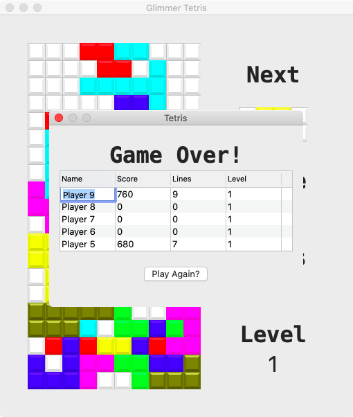
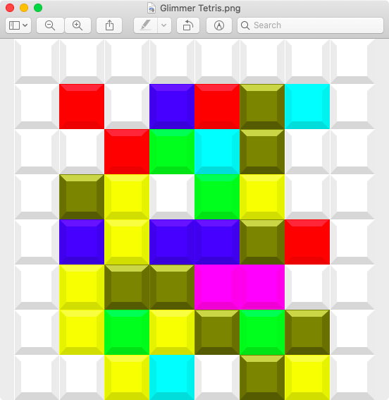
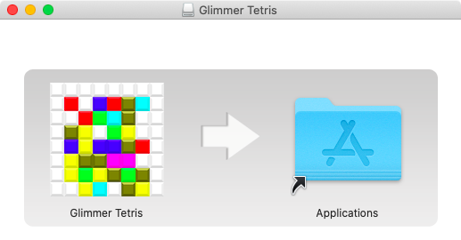

# Day 7 - glimmer-dsl-swt Gem - Glimmer Tetris - High Scores, Menu, & Icon - Show Others How Good You Are!

Written by  [Andy Maleh](https://github.com/AndyObtiva)

_Software Engineering Expert from Montreal, Quebec. Creator of [Glimmer](https://github.com/AndyObtiva/glimmer) and [Abstract Feature Branch](https://github.com/AndyObtiva/abstract_feature_branch). Speaker at RailsConf, RubyConf, AgileConf, EclipseCon, EclipseWorld. Master in Software Engineering, DePaul University, Chicago. Blogs at [Code Mastery Takes Commitment To Bold Coding Adventures](http://andymaleh.blogspot.com/). Snowboarder and Drummer._

## Goal

Show a High Score Dialog at the end of a game with the ability to enter the player name.

Provide the ability to show the High Score Dialog at any point during the game too, pausing the game until the dialog is closed.

Add a top menu bar with menus for various functions such as: Game, View, Options, and Help

Finally, generate an app icon with Glimmer GUI DSL syntax, save it to a file, and set it as the game app icon.

## High Score Dialog



Keep in mind that dialog is a form of a `shell`. Although it has its own keyword `dialog` in Glimmer DSL for SWT for convenience, behind the scenes, it is a `shell` with the `:dialog_trim` SWT style.

The point in this is you need to run this command in the terminal to generate a Custom Shell (not Custom Widget):

```
glimmer "scaffold:customshell[high_score_dialog]"
```

Open `HighScoreDialog` under `app/glimmer_tetris/view/high_score_dialog.rb`, and delete all comments, options, and the `body {}` block.

Replace them with the following:

```ruby
      options :parent_shell, :game
      
      after_body {
        @game_over_observer = observe(game, :game_over) do |game_over|
          close if !game_over
        end
      }
      
      body {
        dialog(parent_shell) {
          row_layout {
            type :vertical
            center true
          }
          text 'Tetris'
          
          label(:center) {
            text bind(game, :game_over) {|game_over| game_over ? 'Game Over!' : 'High Scores'}
            font name: FONT_NAME, height: FONT_TITLE_HEIGHT, style: FONT_TITLE_STYLE
          }
          @high_score_table = table {
            layout_data {
              height 100
            }
            
            table_column {
              text 'Name'
            }
            table_column {
              text 'Score'
            }
            table_column {
              text 'Lines'
            }
            table_column {
              text 'Level'
            }
            
            items bind(game, :high_scores, read_only_sort: true), column_properties(:name, :score, :lines, :level)
          }
          composite {
            row_layout :horizontal
                        
            @play_close_button = button {
              text bind(game, :game_over) {|game_over| game_over ? 'Play Again?' : 'Close'}
              focus true # initial focus
              
              on_widget_selected {
                async_exec { close }
                game.paused = @game_paused
                game.restart! if game.game_over?
              }
            }
          }
          
          on_swt_show {
            @game_paused = game.paused?
            game.paused = true
            if game.game_over? && game.added_high_score?
              game.added_high_score = false
              game.save_high_scores!
              @high_score_table.edit_table_item(
                @high_score_table.items.first, # row item
                0, # column
                write_on_cancel: true,
                after_write: -> {
                  game.save_high_scores!
                  @play_close_button.set_focus
                },
              )
            end
          }
          
          on_shell_closed {
            # guard is needed because there is an observer in Tetris closing on
            # game.show_high_scores change, which gets set below
            unless @closing
              @closing = true
              @high_score_table.cancel_edit!
              game.paused = @game_paused
              game.show_high_scores = false
            else
              @closing = false
            end
          }
          
          on_widget_disposed {
            @game_over_observer.deregister
          }
        }
      }
```

Now, go back to `AppView` and replace the `after_body {}` block code with the following:

```ruby
      observe(@game, :game_over) do |game_over|
        if game_over
          show_high_score_dialog
        else
          start_moving_tetrominos_down
        end
      end
      observe(@game, :show_high_scores) do |show_high_scores|
        if show_high_scores
          show_high_score_dialog
        else
          @high_score_dialog.close unless @high_score_dialog.nil? || @high_score_dialog.disposed? || !@high_score_dialog.visible?
        end
      end
      @game.start!
```

Next, delete the `show_game_over_message_box` method in `AppView` and replace it with the following:

```ruby
      def show_high_score_dialog
        return if @high_score_dialog&.visible?
        @high_score_dialog = high_score_dialog(parent_shell: body_root, game: @game) if @high_score_dialog.nil? || @high_score_dialog.disposed?
        @high_score_dialog.show
      end
```

Do not forget to add this require statement above the top class definition:

```ruby
require_relative 'high_score_dialog'
```

Run:

```
glimmer run
```

Finish a game and you should get the High Score Dialog!


If you hit Play Again? you will start a new game.

If you do not want to start another game, you can hit the ESC keyboard button, and you will exit back to a finished stand-still game.
To start a new one, you need the `menu_item` to do it. That's what the next section is about!

## Menu Bar

This is how the menu bar nested menus look like.


Keep in mind that each `shell` (including dialogs) have their own `menu_bar`. To reuse the same menu items in both the game and the High Score Dialog, you ought to generate a menu bar Custom Widget `tetris_menu_bar` and then reuse in both.

Run this command:

```
glimmer "scaffold:cw[tetris_menu_bar]"
```

Open `TetrisMenuBar` under `app/glimmer_tetris/view/tetris_menu_bar.rb`, delete all comments and the `body {}` block, and add the following code instead:

```ruby
      COMMAND_KEY = OS.mac? ? :command : :ctrl
  
      options :game
      
      body {
        menu_bar {
          menu {
            text '&Game'
            
            menu_item {
              text '&Start'
              enabled bind(game, :game_over)
              accelerator COMMAND_KEY, :s
              
              on_widget_selected {
                game.start!
              }
            }
            menu_item(:check) {
              text '&Pause'
              accelerator COMMAND_KEY, :p
              enabled bind(game, :game_over, on_read: :!) {|value| value && !game.show_high_scores}
              enabled bind(game, :show_high_scores, on_read: :!) {|value| value && !game.game_over}
              selection bind(game, :paused)
            }
            menu_item {
              text '&Restart'
              accelerator COMMAND_KEY, :r
              
              on_widget_selected {
                game.restart!
              }
            }
            menu_item(:separator)
            menu_item {
              text '&Exit'
              accelerator COMMAND_KEY, :x
              
              on_widget_selected {
                parent_proxy.close
              }
            }
          } # end of menu
          
          menu {
            text '&View'
            
            menu {
              text '&High Scores'
              menu_item(:check) {
                text '&Show'
                accelerator COMMAND_KEY, :shift, :h
                selection bind(game, :show_high_scores)
              }
              menu_item {
                text '&Clear'
                accelerator COMMAND_KEY, :shift, :c
                
                on_widget_selected {
                  game.clear_high_scores!
                }
              }
            }
          } # end of menu
          
          menu {
            text '&Options'
            menu_item(:check) {
              text '&Beeping'
              accelerator COMMAND_KEY, :b
              selection bind(game, :beeping)
            }
            menu {
              text 'Up Arrow'
              menu_item(:radio) {
                text '&Instant Down'
                accelerator COMMAND_KEY, :shift, :i
                selection bind(game, :instant_down_on_up, computed_by: :up_arrow_action)
              }
              menu_item(:radio) {
                text 'Rotate &Right'
                accelerator COMMAND_KEY, :shift, :r
                selection bind(game, :rotate_right_on_up, computed_by: :up_arrow_action)
              }
              menu_item(:radio) {
                text 'Rotate &Left'
                accelerator COMMAND_KEY, :shift, :l
                selection bind(game, :rotate_left_on_up, computed_by: :up_arrow_action)
              }
            }
          } # end of menu
          
          menu {
            text '&Help'
            
            menu_item {
              text '&About'
              accelerator COMMAND_KEY, :shift, :a
              
              on_widget_selected {
                parent_custom_shell&.show_about_dialog
              }
            }
          } # end of menu
        }
      }
      
      def parent_custom_shell
        # grab custom shell widget wrapping parent widget proxy (i.e. Tetris) and invoke method on it
        the_parent_custom_shell = parent_proxy&.get_data('custom_shell')
        the_parent_custom_shell if the_parent_custom_shell&.visible?
      end
```

Next, go to `AppView` and add the following require statement above the top class declaration:

```ruby
require_relative 'tetris_menu_bar'
```

And, add the following lines to `AppView` above the `playfield` declaration (the `minimum_size` is just a side improvement that ensures consistent sizing without flicker now that we have a score lane):

```ruby

      tetris_menu_bar(game: @game)

```

Afterwards, go to `HighScoreDialog` and add the following require statement above the top class declaration:

```ruby
require_relative 'tetris_menu_bar'
```

And, add the following line to `HighScoreDialog` above the first `label` declaration:

```ruby

      tetris_menu_bar(game: game)

```

Run:

```
glimmer run
```

Now, you get access to all the menus:


Play around with them to get a full understanding of what each menu item does.

Next, we are going to conclude this article by generating an app icon.

## App Icon

This section should be a fun diversion. After all, we will drop down to Ruby scripting and write a script that generates a Tetris icon.

Create a file under `bin/` called `generate_app_icon.rb`

Open the new file and paste this code in it:

```ruby
require 'glimmer-dsl-swt'
require 'glimmer-cp-bevel'

require_relative '../app/glimmer_tetris/model/tetromino'

include Glimmer

puts 'Building app icon...'
icon_block_size = 64
icon_bevel_size = icon_block_size.to_f / 25.to_f
icon_bevel_pixel_size = 0.16*icon_block_size.to_f
icon_size = 8
icon_pixel_size = icon_block_size * icon_size
tetric_icon_image = image(icon_pixel_size, icon_pixel_size) {
  icon_size.times { |row|
    icon_size.times { |column|
      colored = row >= 1 && column.between?(1, 6)
      color = colored ? color(([:white] + GlimmerTetris::Model::Tetromino::LETTER_COLORS.values).sample) : color(:white)
      x = column * icon_block_size
      y = row * icon_block_size
      bevel(x: x, y: y, base_color: color, size: icon_block_size)
    }
  }
}

puts 'Preparing app icon for saving to file...'
i = org.eclipse.swt.graphics.Image.new(display.swt_display, 512, 512)
gc = org.eclipse.swt.graphics.GC.new(i)
gc.drawImage(tetric_icon_image.swt_image, 0, 0)
il = ImageLoader.new
il.data = [i.image_data]

puts "Saving #{File.expand_path(File.join('..', 'package','linux', 'Glimmer Tetris.png'), __dir__)}"
il.save(File.expand_path(File.join('..', 'package','linux', 'Glimmer Tetris.png'), __dir__), swt(:image_png))
puts 'Done generating app icon.'
```

Now, run:

```
glimmer bin/generate_app_icon.rb
```

This should generate the icon as a `.png` file placing it under `package/linux` since that is the format Linux expects when packaging with the `glimmer package` command.



For the Mac and Windows, you need the `.icns` and `.ico` formats respectively. To obtain, simply perform conversion yourself using a cloud service like cloudconvert.com

The icon is generated randomly. If you would like a different arrangement, simply regenerate until it fits your taste.

## Packaging

Finally, you might want to package the game as a native executable on whatever platform you are running (e.g. `DMG` on the Mac or `MSI` on Windows).

To do so, simply run:

```
glimmer package
```

This should generate all the native executable installable package formats available on your platform, placed under `packages` or `packages/bundles` depending on the format.

On the Mac, you would see something like this:



Alternatively, for a faster run, you can just request a specific format by passing an argument.

On the Mac:

```
glimmer "package[DMG]"
```

On Windows:

```
glimmer "package[MSI]"
```

Advanced packaging is beyond the scope of this article series, but you may learn more about it at the Glimmer DSL for SWT documentation: https://github.com/AMaleh/glimmer-dsl-swt/blob/master/docs/reference/GLIMMER_PACKAGING_AND_DISTRIBUTION.md

## Find Out More

### References

- Code :: [Glimmer Tetris](https://github.com/AMaleh/glimmer-tetris)
- Gem  :: [Glimmer DSL for SWT](https://github.com/AMaleh/glimmer-dsl-swt)
- Blog :: [Glimmer Tetris in One Day! and Many More Glimmer Articles](http://andymaleh.blogspot.com/search/label/Glimmer)
