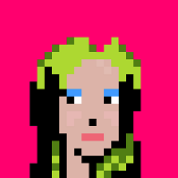
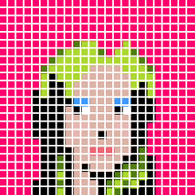
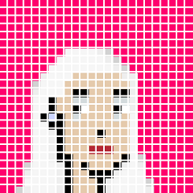

# Day 1 - chunky_png Gem - Turn Pixelated Billie Eilish and Lady Gaga Portraits into True 24x24 Pixel Art


Written by  [Gerald Bauer](https://github.com/geraldb)


##  What's Chunky PNG?


The chunky_png gem let's you read and write pixel images in the
Portable Network Graphics (.PNG) format.


##  Out of Many, One - 24x24 Pixelator

Let's wipe-up a little pixelator that
turns "faux" pixelated portraits into true 24x24 pixel art.


Let's read in a copy of a Billie Eilish portrait in .png, that is,
`billie-eilish-xl.png`.




``` ruby
require 'chunky_png'

img = ChunkyPNG::Image.from_file( './billie-eilish-xl.png' )
```


Let's print out the original image size
and calculate some pixel measurements for the target
true 24x24 pixel art image size.

``` ruby
class Pixelator

  def initialize( img, width=24, height=24 )
    @img    = img
    @width  = width
    @height = height

    ## calculate pixel size / density / resolution
    ##   how many pixels per pixel?
    @xsize, @xoverflow = img.width.divmod( width )
    @ysize, @yoverflow = img.height.divmod( height )

    puts "minify image size from (#{@img.width}x#{@img.height}) to (#{width}x#{height})"
    puts "  pixel size (#{@xsize}x#{@ysize}) - #{@xsize*@ysize} pixel(s) per pixel"
  end
```


Let's try:

``` ruby
pix = Pixelator.new( img )
```

resulting in:

```
minify image size from (992x992) to (24x24)
  pixel size (41x41) - 1681 pixel(s) per pixel
```

That tells us that the "faux" pixelated
portrait uses a 41x41 matrix, that is, 1618 pixels
for a single true pixel
if converted / minified without loss from
992x992 to 24x24.


Without loss?
Let's generate an image that shows the pixel grid. Let's use
a 10 pixel spacing.
Add inside the `Pixelator` class:

``` ruby
  def grid( spacing: 10 )
    width  = @img.width  + (@width-1)*spacing
    height = @img.height + (@height-1)*spacing

    img = ChunkyPNG::Image.new( width, height, ChunkyPNG::Color::WHITE )

    @img.width.times do |x|
      xpixel = x/@xsize
      @img.height.times do |y|
        ypixel = y/@ysize

        ## clip overflow pixels
        xpixel = @width-1   if xpixel >= @width
        ypixel = @height-1  if ypixel >= @height

        color = @img[x,y]
        img[x + spacing*xpixel,
            y + spacing*ypixel] = color
      end
    end
    img
  end
```


And let's try:

``` ruby
pix_grid = pix.grid( spacing: 10 )
pix_grid.save( './billie-eilish-grid.png' )
```

Let's have a looksie:





What a lucky day!
For sure - not 100% picture perfect aligned to the pixel grid
but using a pragmatic the 50% majority color "winner takes all" forumla
is good enough.
Let's add a pixel sampler to the `Pixelator` class:


``` ruby
# pixels by coordinates (x/y) with color statistics / usage
  def pixels
    @pixels ||= begin
                  pixels = []
                  @img.width.times do |x|
                    xpixel = x/@xsize
                    @img.height.times do |y|
                      ypixel = y/@ysize

                      ## skip/cut off overflow pixels
                      next if xpixel >= @width || ypixel >= @height

                      color = @img[x,y]
                      colors = pixels[xpixel+ypixel*@width] ||= Hash.new(0)
                      colors[ color ] += 1
                    end
                  end

                  ## sort pixel colors by usage / count (highest first)
                  pixels = pixels.map do |pixel|
                                         pixel.sort do |l,r|
                                                      r[1] <=> l[1]
                                                    end.to_h
                                      end
                  pixels
                end
  end

  def pixel(x,y)  pixels[x+y*@width]; end
```

Add the `pixelate` method that minifies the portrait to true 24x24 pixel art:

``` ruby
  def pixelate
    img = ChunkyPNG::Image.new( @width, @height )

    @width.times do |x|
      @height.times do |y|
        pixel = pixel( x, y )
        color = pixel.keys[0]
        img[x,y] = color
      end
    end
    img
  end
```

It's showtime!
Let's try:


``` ruby
pix_24x24 = pix.pixelate
pix_24x24.save( './billie-eilish-24x24.png' )
```

Voila!


##  All together now - Let's (re)do Lady Gaga

Let's read in a copy of a Lady Gaga portrait in .png, that is,
`lady-gaga-xl.png`.


``` ruby
img = ChunkyPNG::Image.from_file( './lady-gaga-xl.png' )
```

And let's reuse the `Pixelator`:


``` ruby
pix = Pixelator.new( img )
```

resulting in:

```
minify image size from (992x992) to (24x24)
  pixel size (41x41) - 1681 pixel(s) per pixel
```

And let's try again:

``` ruby
pix_grid = pix.grid( spacing: 10 )
pix_grid.save( './lady-gaga-grid.png' )

pix_24x24 = pix.pixelate
pix_24x24.save( './lady-gaga-24x24.png' )
```

Voila!




## Find Out More

### References

- Home :: [github.com/wvanbergen/chunky_png](https://github.com/wvanbergen/chunky_png)
- Gem :: [chunky_png](https://rubygems.org/gems/chunky_png)
- Docs :: [chunky_png](http://rubydoc.info/gems/chunky_png)


