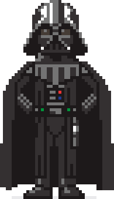

# Day 2 - pixelart Gem - Mint Your Own Pixel Art Images Using Any Design (In ASCII Text) In Any Colors; Incl. 2X/4X/8X Zoom For Bigger Sizes


Written by  [Gerald Bauer](https://github.com/geraldb)


## Paint by Numbers

Let's use the mooncat design #0 (Standing·Smile·Solid·Left)
in the original 21×17 pixel format in ascii text:


```ruby
require 'pixelart'

pixels =<<PIXELS
0 0 0 0 0 0 0 0 0 0 0 0 1 0 0 0 0 0 1 0 0
0 0 0 0 0 0 0 0 0 0 0 1 3 1 0 0 0 1 3 1 0
0 0 0 0 0 0 0 0 0 0 0 1 5 3 1 1 1 3 5 1 0
0 1 1 1 0 0 0 0 0 0 1 1 3 3 3 3 3 3 3 1 1
0 1 3 1 0 0 0 0 0 0 1 3 3 3 3 3 3 3 3 3 1
1 3 1 1 0 1 1 1 1 1 1 3 3 1 3 3 3 1 3 3 1
1 3 1 0 1 1 3 3 3 3 1 3 3 3 3 3 3 3 3 3 1
1 3 1 0 1 3 3 3 3 3 1 3 3 4 3 5 3 4 3 3 1
1 3 1 1 1 3 3 3 3 3 1 3 3 3 4 3 4 3 3 3 1
1 1 3 3 3 3 3 3 3 3 3 1 3 3 3 3 3 3 3 1 0
0 1 1 1 3 3 3 3 3 3 3 3 1 1 1 1 1 1 1 0 0
0 0 0 1 3 3 3 3 3 3 3 3 3 3 3 3 3 3 1 0 0
0 0 0 1 1 3 3 3 1 4 4 4 1 3 3 3 3 3 1 0 0
0 0 0 0 1 1 3 3 3 1 4 1 3 3 1 3 3 1 0 0 0
0 0 0 0 0 1 1 3 3 1 4 1 3 1 1 3 1 0 0 0 0
0 0 0 0 0 0 1 1 3 5 1 1 5 1 1 5 1 0 0 0 0
0 0 0 0 0 0 0 1 1 1 1 1 1 1 1 1 1 0 0 0 0
PIXELS
```

And let's use the genesis white color scheme - super rare only 48 exist in the official MoonCatRescue blockchain contract state storage ;-):

``` ruby
colors = [
  '#555555',   # color 1
  '#d3d3d3',   # color 2
  '#ffffff',   # color 3
  '#aaaaaa',   # color 4
  '#ff9999'    # color 5
]
```

Note: The color 0 (transparent) is auto-magically added / defined.


And let's mint a mooncat image:

``` ruby
img = Image.parse( pixels, colors: colors )
img.save( './i/mooncat_white.png' )
```

And let's try a 3x zoom factor:

``` ruby
img3x = img.zoom( 3 )
img3x.save( './i/mooncat_white-3x.png' )
```

Voila!


Let's change the colors to use the genesis black color scheme:

``` ruby
colors = [
  '#555555',   # color 1
  '#222222',   # color 2
  '#111111',   # color 3
  '#bbbbbb',   # color 4
  '#ff9999'    # color 5
]
```

And let's start minting:

``` ruby
img = Image.parse( pixels, colors: colors )
img.save( './i/mooncat_black.png' )
img.zoom( 3 ).save( './i/mooncat_black-3x.png' )
```

Voila! Black is the new White!


## Beyond Numbers - Yes, You Can - Use Your Own Pixel Color Shortcuts

Let's use the Darth Vader pixel art originally designed by
Aral Tasher in CSS. See the [online demo »](https://codepen.io/araltasher/pen/ajdzNE)

Let's cut-n-paste the pixel art matrix:


``` ruby
pixels = <<PIXELS
o o o o o o o o o o o o o o o o o lg lg lg dg o o o o o o o o o o o o o o o o o
o o o o o o o o o o o o o o dg lg lg w lg lg dg dg lg dg o o o o o o o o o o o o o o
o o o o o o o o o o o o o dg lg w lg w lg lg dg dg w lg  dg o o o o o o o o o o o o o
o o o o o o o o o o o o dg lg w w lg w lg lg dg dg w w  lg dg o o o o o o o o o o o
o o o o o o o o o o o o dg dg w w lg w lg lg dg dg w w  dg dg o o o o o o o o o o o
o o o o o o o o o o o dg dg dg lg w lg w lg lg dg dg w lg dg dg dg o o o o o o o o o o
o o o o o o o o o o o dg dg dg w lg lg w lg lg dg dg lg w dg dg dg o o o o o o o o o o
o o o o o o o o o o o dg dg w lg lg lg w lg lg dg dg lg lg w dg dg o o o o o o o o o o
o o o o o o o o o o o dg lg lg b b b lg dg dg lg b b b lg lg dg o o o o o o o o o o
o o o o o o o o o o o dg lg b b b b b lg lg b b b b b lg dg o o o o o o o o o o
o o o o o o o o o o o lg b b db lg db b dg dg b lg db db b b lg o o o o o o o o o o
o o o o o o o o o o lg b b b db db db b lg lg b db db db b b b lg o o o o o o o o o
o o o o o o o o o o lg b b dg lg lg lg lg b b lg lg lg lg dg b b lg o o o o o o o o o
o o o o o o o o o lg b b b dg dg dg dg lg b b lg dg dg dg dg b b b lg o o o o o o o o
o o o o o o o o o lg b b b dg dg dg lg b b b b lg dg dg dg b b b lg o o o o o o o o
o o o o o o o o lg b b b b b dg dg b dg b dg b b lg dg b b b b b lg o o o o o o o
o o o o o o o o b b b b b b w b b dg b dg b dg b w b b b b b b o o o o o o o
o o o o o o o o b b b b b b dg dg dg dg dg dg dg dg dg dg b b b b b b o o o o o o o
o o o o o o o o o b b b b lg b b b b b b b b b b b b b b b o o o o o o o o
o o o o o o o o o o o o b lg lg dg dg b b b b dg dg b b b o o o o o o o o o o o
o o o o o o o o o o o o lg lg dg dg dg dg b b b dg dg dg dg b b o o o o o o o o o o
o o o o o o o o o dg dg b dg dg dg dg dg dg dg dg dg dg dg dg dg dg dg b dg dg o o o o o o o
o o o o o o o o dg dg b b lg lg lg lg lg lg lg lg lg lg lg lg lg lg lg b b dg dg o o o o o o
o o o o o o o dg dg b lg b lg dg lg lg dg dg lg lg dg dg lg lg dg dg lg b lg b dg dg o o o o o
o o o o o o dg dg b lg lg b lg dg lg lg dg dg lg lg dg dg lg lg dg dg lg b lg lg b dg dg o o o o
o o o o o dg dg b b b b b lg dg lg lg dg dg lg lg dg dg lg lg dg dg lg b b b b b dg dg
o o o o dg dg dg b dg dg b b b b lg lg dg dg lg lg dg dg lg lg b b b b dg dg dg b dg dg dg
o o o dg dg dg b dg dg dg b b b dg b b dg dg lg lg dg dg b b b dg b b b dg dg dg b dg dg dg
o o o dg dg b dg dg dg b b b dg dg dg b b b lg lg b b b dg dg dg b b b b dg dg dg b dg dg
o o dg dg dg b dg dg b b b b dg dg dg b lg lg b b lg lg dg dg dg dg b b b b b dg dg b dg dg dg
o o dg dg dg b dg b b b b b dg dg dg b b b b b b b dg b dg dg b b b b b b dg b dg dg dg
o dg dg dg dg b dg b b b b b dg b dg b b lg lg b r b dg b dg dg b b b b b b dg b dg dg dg dg
o dg dg dg dg b dg lg b b b b dg b dg b b b b b b b dg b dg dg b b b b b lg dg b dg dg dg dg
o dg dg dg dg b lg dg lg b b b dg b dg b b lg lg b blu b dg b dg dg b b b b lg dg lg b dg dg dg dg
o dg dg dg dg b dg lg dg lg b b dg b dg b b b b b b b dg b dg dg b b b lg dg lg dg b dg dg dg dg
o dg dg dg dg b dg dg lg dg lg b dg b dg b lg lg lg lg lg lg b b dg dg b b lg dg lg dg dg b dg dg dg dg
o dg dg dg dg b b dg dg lg dg b b b b b b b b b b b b b b b b b dg lg dg dg b b dg dg dg dg
o dg dg dg dg b b b dg dg dg b lg b g b b lg lg lg lg b b g b lg b b dg dg dg b b b dg dg dg dg
o dg dg dg dg b b b b dg b b b b b b b dg dg lg lg b b b b b b b b dg b b b b dg dg dg dg
o dg dg dg dg b b b b b b b b b b b b b b b b b b b b b b b b b b b b b dg dg dg dg
o dg dg dg dg b b b b b b b dg b dg b dg dg dg dg dg dg b dg b lg b b b b b b b b dg dg dg dg
o dg dg dg b b b b b b b b dg b dg b dg dg dg dg dg dg b dg b lg dg b b b b b b b b dg dg dg
o dg dg dg b b b b b b b b b dg dg b dg dg dg dg dg dg b dg b dg dg b b b b b b b b dg dg dg
o dg dg dg b b b b b b b b b dg dg b b dg dg dg dg b b dg b w lg b b b b b b b b dg dg dg
o dg dg dg b b b b b b b b b dg dg b b dg dg dg dg b b dg b w lg b b b b b b b b dg dg dg
o dg dg dg b b b b b b b b b dg dg b dg b dg dg b dg b dg b lg dg b b b b b b b b dg dg dg
o dg dg dg b b b b b b b b b dg dg b dg dg b b dg dg b dg b dg dg b b b b b b b b dg dg dg
o dg dg dg b b b b b b b b dg dg dg b dg dg b dg dg dg b dg b lg dg b b b b b b b b dg dg dg
o dg dg dg b b b b b b b b dg dg dg b dg dg b dg dg dg b dg b lg dg b b b b b b b b dg dg dg
dg dg dg dg b b b b b b b b dg dg dg b dg dg b dg dg dg b dg b lg dg b b b b b b b b dg dg dg dg
dg dg dg dg b b b b b b b b dg dg dg b dg b b b dg dg b dg b b b b b b b b b b b dg dg dg dg
dg dg dg dg b b b b b b b b dg dg dg b dg b b b dg dg b dg dg dg b b b b b b b b b dg dg dg dg
dg dg dg dg b b b b b b b b dg dg dg b dg b b b dg dg b dg dg dg b b b b b b b b b dg dg dg dg
dg dg dg dg b b b b b b b b dg b dg b dg b b b dg dg b dg dg dg b b b b b b b b b dg dg dg dg
dg dg dg dg b b b b b b b b dg b dg b dg b b b dg dg b dg dg dg b b b b b b b b b dg dg dg dg
dg dg dg dg b b b b b b b b dg b dg b dg b b b dg dg b dg dg dg b b b b b b b b b dg dg dg dg
dg dg dg dg b b b b b b b b dg b dg b dg b b b dg dg b dg b dg b b b b b b b b b dg dg dg dg
dg dg dg dg b b b b b b b b dg b dg b dg b b b dg dg b dg b dg b b b b b b b b b dg dg dg dg
dg dg dg dg b b b b b b b b dg b dg b dg b b b dg dg b dg b dg b b b b b b b b b dg dg dg dg
dg dg dg dg b b b b b b b b dg b dg b dg b b b dg dg b dg b dg b b b b b b b b b dg dg dg dg
dg dg dg dg b b b b b b b b b b b b dg b b b dg dg b b b b b b b b b b b b b dg dg dg dg
dg dg dg dg b b b b b b b b dg lg dg dg dg b b b dg lg dg dg dg dg b b b b b b b b b dg dg dg dg
dg dg dg dg b b b b b b b b dg lg dg dg dg b b b dg lg dg dg dg dg b b b b b b b b b dg dg dg dg
dg dg dg dg b b o o o o o o b b b dg dg b b b dg dg dg b b b o o o o o o o b b dg dg dg dg
o o dg dg o o o o o o o b lg lg dg b b b o o b b lg dg dg dg b o o o o o o b b dg dg dg dg
o o o o o o o o o b lg lg dg dg dg dg dg b o o b dg lg lg dg dg dg b
o o o o o o o o b dg dg dg dg dg dg dg dg b o o b dg dg dg dg dg dg b b
o o o o ulg ulg ulg ulg b b b b b b b b b b ulg ulg b b b b b b b b b ulg ulg ulg ulg
PIXELS
```


Note: Yes, you can use any number (e.g. `0` `1` `2` `3` etc)
or shortcut (e.g. `o` `b` `ulg` `lg` etc) for pixels.
Only make sure you have a color map matching your shortcuts.


Let's add the color map:

``` ruby
colors = {
   o:   'transparent',
   b:   '#1D191A',
   ulg: '#eaeaec',
   lg:  '#747474',
   db:  '#453C35',
   dg:  '#343031',
   w:   '#fff',
   r:   '#fc3435',
   blu: '#1F3A93',
   g:   '#00943b'
}
```


And let's mint an imperial master image:

``` ruby
img = Image.parse( pixels, colors: colors )
img.save( './i/vader.png' )
```

And let's try a 5x zoom factor:

``` ruby
img5x = img.zoom( 5 )
img5x.save( './i/vader5x.png' )
```

Voila!





## Find Out More

### References

- Home :: [github.com/rubycoco/pixel/pixelart](https://github.com/rubycoco/pixel/tree/master/pixelart)
- Gem :: [pixelart](https://rubygems.org/gems/pixelart)
- Docs :: [pixelart](http://rubydoc.info/gems/pixelart)
